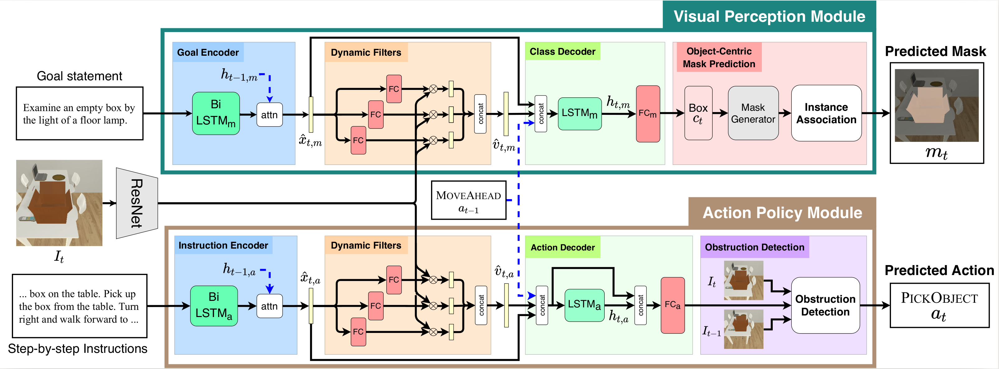

# MOCA
<a href=""> <b> MOCA: A Modular Object-Centric Approach for Interactive Instruction Following </b> </a>
<br>
<a href=""> Kunal Pratap Singh* </a>,
<a href=""> Suvaansh Bhambri* </a>,
<a href=""> Byeonghwi Kim* </a>,
<a href="http://roozbehm.info/"> Roozbeh Mottaghi </a>,
<a href="http://ppolon.github.io/"> Jonghyun Choi </a>

<b> MOCA </b> (<b>M</b>odular <b>O</b>bject-<b>C</b>entric <b>A</b>pproach) is a modular architecture that decouples a task into visual perception and action policy.



## Dataset
To download the ALFRED dataset, please refer to the repository of <a href="https://github.com/askforalfred/alfred"> ALFRED </a>.

## Training
```
python models/train/train_seq2seq.py --dout exp/moca --gpu --save_every_epoch
```

## Evaluation
```
python models/eval/eval_seq2seq.py --model_path "exp/moca/best_seen.pth" --eval_split valid_seen --gpu --num_threads 4
```

## Submission
```
python models/eval/leaderboard.py --model_path "exp/moca/best_seen.pth" --num_threads 4
```

## Citation
```
@citation
```
