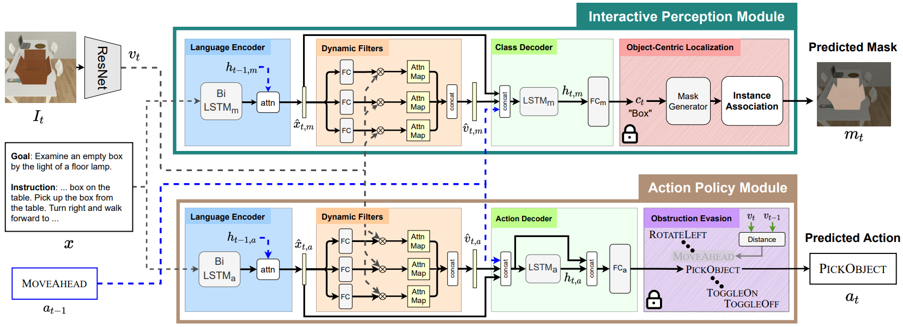

# MOCA
<a href="http://arxiv.org/abs/2012.03208"> <b> Factorizing Perception and Policy for Interactive Instruction Following </b> </a>
<br>
<a href="https://kunalmessi10.github.io/"> Kunal Pratap Singh* </a>,
<a href="https://www.linkedin.com/in/suvaansh-bhambri-1784bab7/"> Suvaansh Bhambri* </a>,
<a href="https://bhkim94.github.io/"> Byeonghwi Kim* </a>,
<a href="http://roozbehm.info/"> Roozbeh Mottaghi </a>,
<a href="http://ppolon.github.io/"> Jonghyun Choi </a>
<br>
<a href="http://iccv2021.thecvf.com/home"> ICCV 2021 </a>

<b> MOCA </b> (<b>M</b>odular <b>O</b>bject-<b>C</b>entric <b>A</b>pproach) is a modular architecture that decouples a task into visual perception and action policy.
The action policy module (APM) is responsible for sequential action prediction, whereas the interactive perception module (IPM) generates pixel-wise interaction mask for the objects of interest for manipulation.
MOCA addresses long-horizon instruction following tasks based on egocentric RGB observations and natural language instructions on the <a href="https://github.com/askforalfred/alfred">ALFRED</a> benchmark.
<br>
(Prev: MOCA: A Modular Object-Centric Approach for Interactive Instruction Following)




## Environment
### Clone repository
```
$ git clone https://github.com/gistvision/moca.git moca
$ export ALFRED_ROOT=$(pwd)/moca
```

### Install requirements
```
$ virtualenv -p $(which python3) --system-site-packages moca_env
$ source moca_env/bin/activate

$ cd $ALFRED_ROOT
$ pip install --upgrade pip
$ pip install -r requirements.txt
```


## Download
Download the ResNet-18 features and annotation files from <a href="https://huggingface.co/datasets/byeonghwikim/abp_dataset">the Hugging Face repo</a>.
```
git clone https://huggingface.co/byeonghwikim/abp_dataset data/json_feat_2.1.0
```

## Training
To train MOCA, run `train_seq2seq.py` with hyper-parameters below. <br>
```
python models/train/train_seq2seq.py --data <path_to_dataset> --model seq2seq_im_mask --dout <path_to_save_weight> --splits data/splits/oct21.json --gpu --batch <batch_size> --pm_aux_loss_wt <pm_aux_loss_wt_coeff> --subgoal_aux_loss_wt <subgoal_aux_loss_wt_coeff>
```
~~**Note**: As mentioned in the repository of <a href="https://github.com/askforalfred/alfred/tree/master/models">ALFRED</a>, run with `--preprocess` only once for preprocessed json files.~~ We provide the already preprocessed annotation files and the vocab file. You may not need to run the code with ```--preprocess```. <br>
**Note**: All hyperparameters used for the experiments in the paper are set as default.

For example, if you want train MOCA and save the weights for all epochs in "exp/moca" with all hyperparameters used in the experiments in the paper, you may use the command below. <br>
```
python models/train/train_seq2seq.py --dout exp/moca --gpu --save_every_epoch
```
**Note**: The option, `--save_every_epoch`, saves weights for all epochs and therefore could take a lot of space.


## Evaluation
### Task Evaluation
To evaluate MOCA, run `eval_seq2seq.py` with hyper-parameters below. <br>
To evaluate a model in the `seen` or `unseen` environment, pass `valid_seen` or `valid_unseen` to `--eval_split`.
```
python models/eval/eval_seq2seq.py --data <path_to_dataset> --model models.model.seq2seq_im_mask --model_path <path_to_weight> --eval_split <eval_split> --gpu --num_threads <thread_num>
```
**Note**: All hyperparameters used for the experiments in the paper are set as default.

If you want to evaluate our pretrained model saved in `exp/pretrained/pretrained.pth` in the `seen` validation, you may use the command below.
```
python models/eval/eval_seq2seq.py --model_path "exp/pretrained/pretrained.pth" --eval_split valid_seen --gpu --num_threads 4
```

### Subgoal Evaluation
To evaluate MOCA for subgoals, run `eval_seq2seq.py` with with the option `--subgoals <subgoals>`. <br>
The option takes `all` for all subgoals and `GotoLocation`, `PickupObject`, `PutObject`, `CoolObject`, `HeatObject`, `CleanObject`, `SliceObject`, and `ToggleObject` for each subgoal.
The option can take multiple subgoals.
For more details, refer to <a href="https://github.com/askforalfred/alfred/tree/master/models">ALFRED</a>.
```
python models/eval/eval_seq2seq.py --data <path_to_dataset> --model models.model.seq2seq_im_mask --model_path <path_to_weight> --eval_split <eval_split> --gpu --num_threads <thread_num> --subgoals <subgoals>
```
**Note**: All hyperparameters used for the experiments in the paper are set as default.

If you want to evaluate our pretrained model saved in `exp/pretrained/pretrained.pth` in the `seen` validation for all subgoals, you may use the command below.
```
python models/eval/eval_seq2seq.py --model_path "exp/pretrained/pretrained.pth" --eval_split valid_seen --gpu --num_threads 4 --subgoals all
```


## Hardware 
Trained and Tested on:
- **GPU** - GTX 2080 Ti (11GB)
- **CPU** - Intel(R) Core(TM) i9-9900K CPU @ 3.60GHz
- **RAM** - 32GB
- **OS** - Ubuntu 18.04


## License
MIT License


## Citation
```
@article{singh2021factorizing,
  title={Factorizing Perception and Policy for Interactive Instruction Following},
  author={Singh, Kunal Pratap and Bhambri, Suvaansh and Kim, Byeonghwi and Mottaghi, Roozbeh and Choi, Jonghyun},
  journal={ICCV},
  year={2021}
}
```
